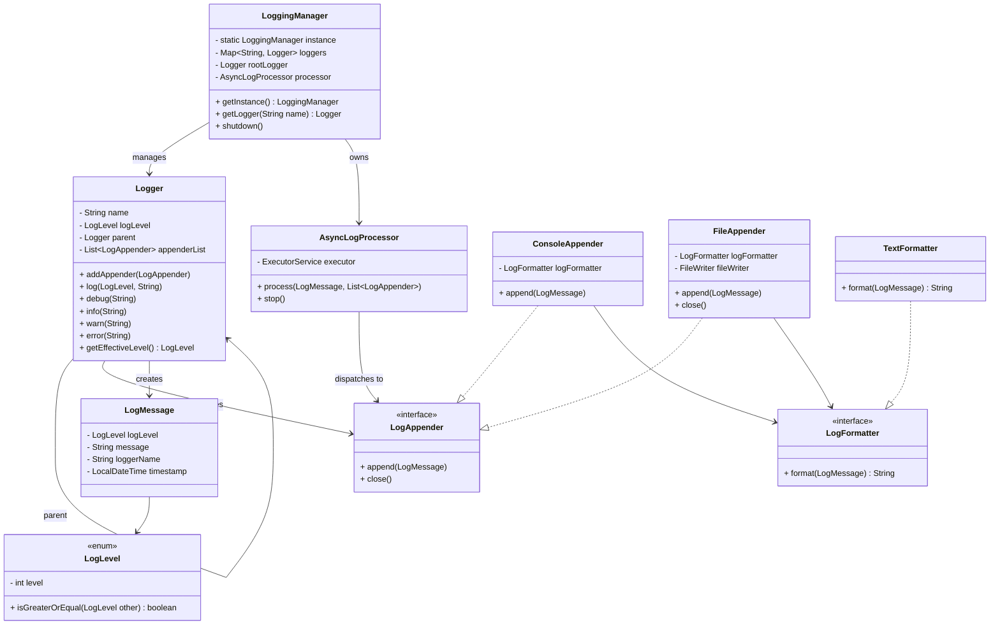

# Logging Framework

## Entity Overview

| Entity              | Type                      | Purpose                                                                                                                   |
|---------------------|---------------------------|---------------------------------------------------------------------------------------------------------------------------|
| `LoggingManager`    | Class (Singleton)         | Central orchestrator. Maintains logger registry, root logger, async processor, and manages shutdown lifecycle.            |
| `Logger`            | Class                     | Core logging unit. Performs level filtering, maintains hierarchy, holds appenders, and delegates async processing.        |
| `AsyncLogProcessor` | Class                     | Handles asynchronous log execution using a single-threaded `ExecutorService` to ensure non-blocking, ordered log writing. |
| `LogMessage`        | Class (Immutable Model)   | Represents a single log event containing level, timestamp, logger name, and message.                                      |
| `LogLevel`          | Enum                      | Defines severity hierarchy and provides comparison logic for filtering.                                                   |
| `LogAppender`       | Interface                 | Abstraction for output destinations (console, file, etc.). Enables pluggable output strategies.                           |
| `ConsoleAppender`   | Concrete Class (Strategy) | Writes formatted log messages to standard output.                                                                         |
| `FileAppender`      | Concrete Class (Strategy) | Writes formatted log messages to a file with directory handling and resource management.                                  |
| `LogFormatter`      | Interface                 | Abstraction for formatting logic. Allows multiple output formats.                                                         |
| `TextFormatter`     | Concrete Class (Strategy) | Formats log messages into human-readable text format with timestamp and metadata.                                         |
| `LoggingDemo`       | Client Class              | Demonstrates framework usage by configuring loggers, appenders, and generating log events.                                |


## Design Patterns

| Design Pattern                              | Applied In                                        | Purpose                                                | Why It Fits Here                                                              |
|---------------------------------------------|---------------------------------------------------|--------------------------------------------------------|-------------------------------------------------------------------------------|
| **Singleton**                               | `LoggingManager`                                  | Ensures a single global logging configuration instance | Logging system should have centralized configuration and lifecycle control    |
| **Strategy**                                | `LogAppender` (`ConsoleAppender`, `FileAppender`) | Allows interchangeable output destinations             | Enables adding new appenders (DB, Kafka, Remote API) without modifying Logger |
| **Strategy**                                | `LogFormatter` (`TextFormatter`)                  | Allows interchangeable formatting logic                | Supports multiple output formats (Text, JSON, XML) without changing appenders |
| **Composite-like (Hierarchy Pattern)**      | `Logger` with parent reference                    | Enables hierarchical logger structure                  | Child loggers inherit level and propagate logs to parents (like Log4j)        |
| **Producer–Consumer (Concurrency Pattern)** | `AsyncLogProcessor`                               | Decouples log generation from log writing              | Prevents blocking main thread and ensures ordered asynchronous execution      |
| **Factory-like Creation**                   | `LoggingManager.getLogger()`                      | Encapsulates logger creation logic                     | Controls logger hierarchy construction and avoids external instantiation      |

## UML




## Architecture

```
Client Code
    ↓
Logger
    ↓
Level Filtering
    ↓
Hierarchy Propagation
    ↓
AsyncLogProcessor
    ↓
Executor Queue
    ↓
Worker Thread
    ↓
Appender(s)
    ↓
Formatter
    ↓
Output (Console / File)
```

## How Level Filtering works?

- Prevent lower-severity logs from being processed.
- Example: ```rootLogger.setLogLevel(LogLevel.INFO);```
- Ignored
    ```pgsql
    DEBUG → ignored
    INFO  → allowed
    WARN  → allowed
    ERROR → allowed
    ```
  
- Flow
  - Determine Effective Level
  - If current logger has level → use it 
  - Else → check parent
  - Else → check parent’s parent 
  - Eventually → root 
  - If nothing set → default DEBUG
- Example
  ```pgsql
  root (INFO)
  └── com.example.db (DEBUG)
  └── com.example.db.connection (null)
  ```
  - if ```connectionLogger.debug("msg");```
  - Effective level resolution:
    - connection → null 
    - parent db → DEBUG 
    - so effective level = DEBUG


## How Hierarchy Propagation works?

- Allow child loggers to inherit appenders from parent loggers.
- When ```serviceLogger.info("Service starting");```
- Hierarchy:
  ```pgsql
    root (ConsoleAppender)
    └── com
    └── example
    └── service (FileAppender)
    ```
  
- Execution Flow
  - service logger processes message 
  - If service has appenders → send to them
  - Move to parent 
  - Parent has appenders → send to them
  - Continue until root

- So:
  - FileAppender handles it
  - ConsoleAppender handles it