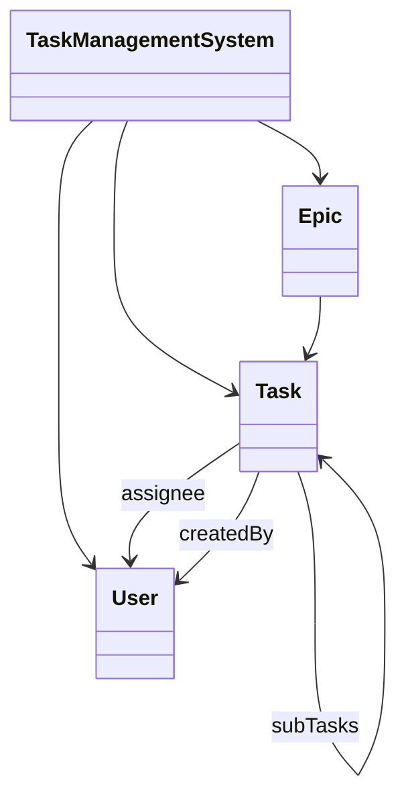
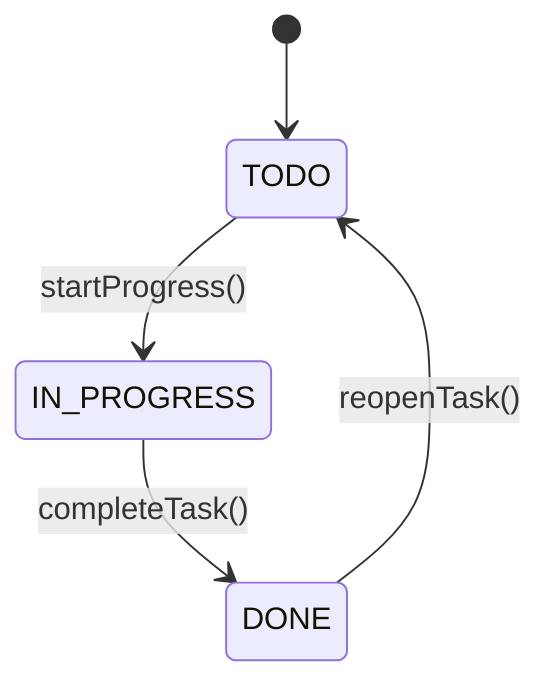
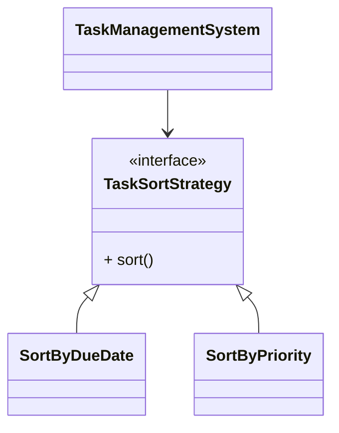
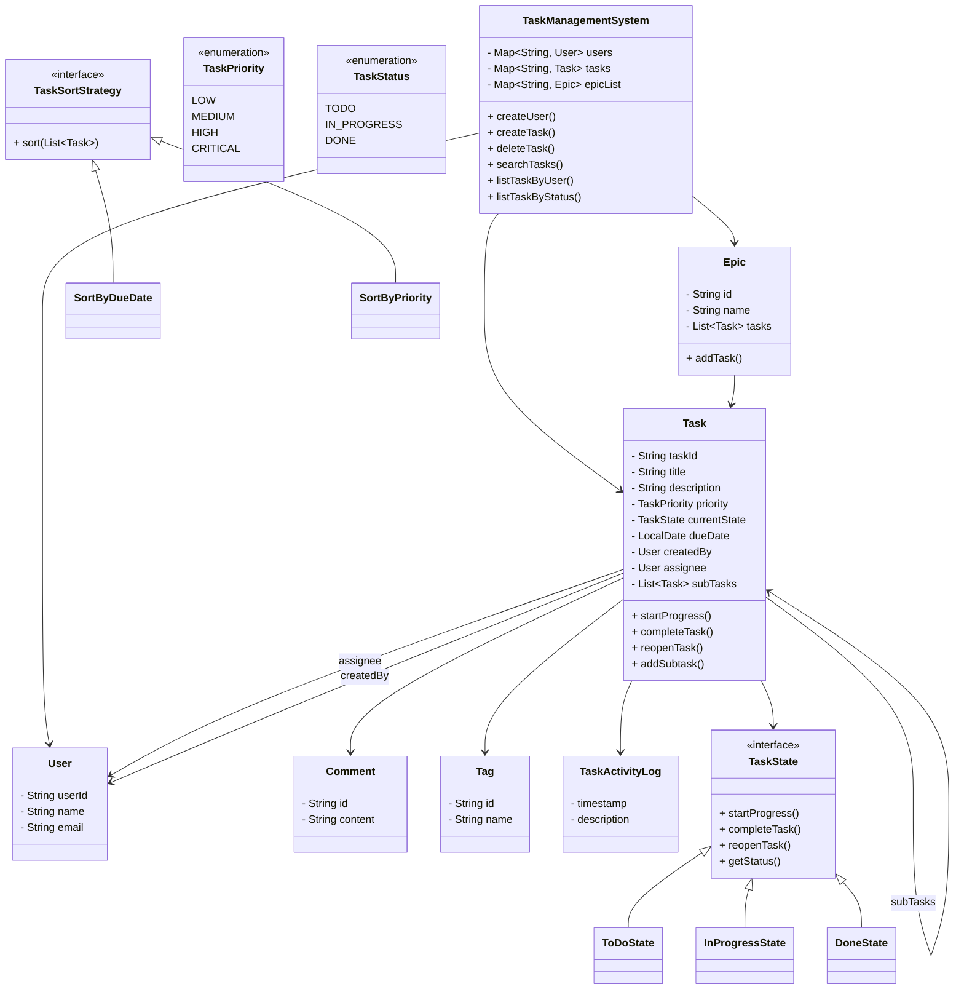

# Design a Task Management System

A thread-safe task management system that supports:
- Task creation and lifecycle management
- User assignment
- Epics (task grouping)
- Subtasks (hierarchical tasks)
- Searching and filtering
- Extensible sorting and state transitions

The system is designed using OOP principles + design patterns to ensure scalability and maintainability.

## Entity Overview

| Category             | Class / Enum           | Responsibility                                                                |
|----------------------|------------------------|-------------------------------------------------------------------------------|
| **Core System**      | `TaskManagementSystem` | Central coordinator managing users, tasks, and epics (CRUD + search + filter) |
|                      | `TaskManagementDemo`   | Driver class to simulate system behavior                                      |
| **Model**            | `Task`                 | Core entity representing a task with lifecycle, subtasks, logs, and metadata  |
|                      | `Epic`                 | Groups multiple tasks (acts as task container)                                |
|                      | `User`                 | Represents a system user                                                      |
|                      | `Comment`              | Stores user comments on tasks                                                 |
|                      | `Tag`                  | Labels associated with tasks                                                  |
|                      | `TaskActivityLog`      | Tracks task history and actions                                               |
| **Enums**            | `TaskPriority`         | Defines task priority levels (LOW → CRITICAL)                                 |
|                      | `TaskStatus`           | Defines task lifecycle states (TODO, IN_PROGRESS, DONE)                       |
| **State Pattern**    | `TaskState`            | Interface defining task state behavior                                        |
|                      | `ToDoState`            | Initial task state                                                            |
|                      | `InProgressState`      | Task is actively being worked on                                              |
|                      | `DoneState`            | Task is completed                                                             |
| **Strategy Pattern** | `TaskSortStrategy`     | Interface for sorting tasks                                                   |
|                      | `SortByDueDate`        | Sort tasks by due date                                                        |
|                      | `SortByPriority`       | Sort tasks by priority                                                        |
| **Builder Pattern**  | `TaskBuilder`          | Builds Task objects with optional fields                                      |


## Design Patterns Used

| Pattern                  | Used In                                                  | Problem Solved                                    | Why This Pattern                                        |
|--------------------------|----------------------------------------------------------|---------------------------------------------------|---------------------------------------------------------|
| **Singleton**            | `TaskManagementSystem`                                   | Multiple instances causing inconsistent state     | Ensures single global instance managing all tasks/users |
| **Builder**              | `Task (TaskBuilder)`                                     | Complex object creation with many optional fields | Avoids telescoping constructors, improves readability   |
| **Strategy**             | `TaskSortStrategy`, `SortByDueDate`, `SortByPriority`    | Multiple sorting behaviors with conditional logic | Enables dynamic and extensible sorting (OCP compliant)  |
| **State**                | `TaskState`, `ToDoState`, `InProgressState`, `DoneState` | Complex lifecycle transitions using conditionals  | Encapsulates state behavior and transitions cleanly     |
| **Thread-Safety Design** | `ConcurrentHashMap`, `synchronized` methods              | Race conditions in concurrent environment         | Ensures safe updates and consistent data                |


## High Level Class Diagram



## State Pattern Diagram



## Strategy Pattern Diagram



## Key Design Decisions

- Used State Pattern to cleanly manage task lifecycle transitions
- Used Strategy Pattern for flexible sorting
- Used Builder Pattern to handle complex object creation
- Used Singleton to centralize system control
- Designed system with thread safety in mind
- Maintained separation of concerns:
  - Model
  - Strategy
  - State
  - Core system

## Project Structure

```
taskManagement/
│
├── enums/
│   ├── TaskPriority.java
│   ├── TaskStatus.java
│
├── model/
│   ├── Task.java
│   ├── Epic.java
│   ├── User.java
│   ├── Comment.java
│   ├── Tag.java
│   ├── TaskActivityLog.java
│
├── state/
│   ├── TaskState.java
│   ├── ToDoState.java
│   ├── InProgressState.java
│   ├── DoneState.java
│
├── strategy/
│   ├── TaskSortStrategy.java
│   ├── SortByDueDate.java
│   ├── SortByPriority.java
│
├── TaskManagementSystem.java
├── TaskManagementDemo.java
```

## Full Class Diagram



## Future Enhancements

| Category               | Enhancement                     | Description                                              | Impact                                 | Priority  |
|------------------------|---------------------------------|----------------------------------------------------------|----------------------------------------|-----------|
| **Scalability**        | Database Integration            | Replace in-memory storage with SQL/NoSQL DB              | Enables persistence, large-scale usage | 🔴 High   |
|                        | Repository Layer                | Introduce Repository pattern for data access abstraction | Decouples business logic from storage  | 🔴 High   |
|                        | Pagination                      | Add pagination for task listing/search                   | Handles large datasets efficiently     | 🟠 Medium |
| **API Layer**          | REST APIs                       | Expose functionality via Spring Boot APIs                | Enables frontend/mobile integration    | 🔴 High   |
|                        | Service Layer                   | Introduce Controller-Service-Repository architecture     | Improves separation of concerns        | 🔴 High   |
| **Concurrency**        | Fine-Grained Locking            | Replace coarse `synchronized` methods                    | Improves performance under concurrency | 🟠 Medium |
|                        | Async Processing                | Use ExecutorService for background tasks                 | Improves responsiveness                | 🟠 Medium |
| **Search & Filtering** | Case-Insensitive + Fuzzy Search | Improve search quality and UX                            | Better usability                       | 🔴 High   |
|                        | Advanced Filters                | Filter by priority, due date, tags                       | More powerful querying                 | 🟠 Medium |
|                        | Search Indexing                 | Use Elasticsearch / indexing                             | Reduces search complexity from O(n)    | 🔴 High   |
| **Task Features**      | Task Dependencies               | Support blocking/linked tasks                            | Enables workflow management            | 🟠 Medium |
|                        | Recurring Tasks                 | Auto-create repeated tasks                               | Useful for real-world scenarios        | 🟢 Low    |
|                        | Notifications                   | Alerts for deadlines, assignments                        | Improves engagement                    | 🟠 Medium |
|                        | Attachments                     | Support file uploads in tasks                            | Enhances usability                     | 🟢 Low    |
| **Security**           | Authentication                  | Add login (JWT/OAuth)                                    | Secures system                         | 🔴 High   |
|                        | RBAC                            | Role-based access control                                | Controls permissions                   | 🔴 High   |
| **Observability**      | Logging Framework               | Replace `System.out` with structured logging             | Better debugging/monitoring            | 🔴        |
