# Conference Room Booking System

A thread-safe, flexible room booking system with support for single and recurring bookings, featuring the Strategy Pattern for flexible room selection algorithms.

## Overview

This Room Booking System is a comprehensive, production-ready application that allows employees to book rooms for single or recurring meetings. It supports **daily, weekly, biweekly, and monthly recurrences**, manages room and employee inventories, and provides flexible room selection strategies.

**Key Features:**
- ✅ **Thread-Safe**: Comprehensive synchronization for multi-threaded environments
- ✅ **Flexible**: Strategy Pattern for customizable room selection
- ✅ **Singleton**: Single system instance across application
- ✅ **Dependency Injection**: Loose coupling, easy testing
- ✅ **Recurring Bookings**: Atomic operations with automatic rollback
- ✅ **Rich Inventory Management**: ConcurrentHashMap-based repositories

---

## Table of Contents

1. [Entities and Responsibilities](#entities-and-responsibilities)
2. [Design Patterns](#design-patterns)
3. [Thread Safety](#thread-safety)
4. [Strategy Pattern](#strategy-pattern)
5. [Booking Sequence](#booking-sequence)
6. [Usage Examples](#usage-examples)
7. [Architecture](#architecture)
8. [Assumptions](#assumptions)

---

## Entities and Responsibilities

| Entity | Responsibilities | Key Attributes | Thread-Safe |
|--------|---|---|---|
| `RoomBookingSystem` | Facade/Singleton entry point | `systemInstance`, `orchestrator` | ✅ |
| `RoomBookingOrchestrator` | Core business logic, orchestrates workflows | `roomInventory`, `employeeInventory`, `roomSelectionStrategy`, `recurringRoomSelectionStrategy` | ✅ |
| `RoomInventory` | Stores rooms, query methods | `ConcurrentHashMap<RoomType, ConcurrentHashMap<String, Room>>` | ✅ |
| `EmployeeInventory` | Stores employees, lookup methods | `ConcurrentHashMap<UUID, Employee>` | ✅ |
| `Room` | Manages booking slots, availability | `roomId`, `roomName`, `roomType`, `bookedSlotsByDay` | ✅ |
| `Employee` | Represents employee and bookings | `employeeId`, `employeeName`, `departmentName`, `bookings` (CopyOnWriteArrayList) | ✅ |
| `Booking` | Represents a single booking instance | `bookingId`, `room`, `bookedSlots`, `employeeName`, `day` | ✅ |
| `Recurrence` | Holds recurring booking parameters | `numberOfWeeks`, `startSlot`, `durationInMinutes`, `dayOfWeek`, `frequencyType` | N/A |
| `RoomType` | Enum for room size | `SMALL`, `LARGE` | N/A |
| `FrequencyType` | Enum for recurrence frequency | `DAILY`, `WEEKLY`, `BIWEEKLY`, `MONTHLY` | N/A |

---

## Design Patterns

### 1. Singleton Pattern
- **Class**: `RoomBookingSystem`
- **Implementation**: Synchronized `getInstance()` method
- **Purpose**: Ensures single system instance across application

### 2. Facade Pattern
- **Class**: `RoomBookingSystem`
- **Purpose**: Provides simplified interface to complex subsystems

### 3. Dependency Injection
- **Class**: `RoomBookingOrchestrator`
- **Purpose**: Constructor injection of repositories for testability

### 4. Strategy Pattern 
- **For Single Bookings**: `RoomStrategy` interface with 3 implementations
- **For Recurring Bookings**: `RecurringRoomStrategy` interface with 3 implementations
- **Purpose**: Runtime-switchable room selection algorithms

### 5. Repository Pattern
- **Classes**: `RoomInventory`, `EmployeeInventory`
- **Purpose**: Abstract data access logic with consistent interface

---

## Thread Safety

### Comprehensive Thread-Safe Implementation

#### 1. Synchronized Singleton
```java
public static synchronized RoomBookingSystem getInstance() {
    if(systemInstance==null)
        systemInstance = new RoomBookingSystem();
    return systemInstance;
}
```

#### 2. Concurrent Collections
- **RoomInventory**: `ConcurrentHashMap<RoomType, ConcurrentHashMap<String, Room>>`
- **EmployeeInventory**: `ConcurrentHashMap<UUID, Employee>`
- **Employee Bookings**: `CopyOnWriteArrayList<Booking>`

#### 3. Synchronized Repository Methods
```java
public synchronized void addRoom(Room room)
public synchronized Room getRoom(String roomId)
public synchronized Map<String, Room> getAllRooms()  // Returns safe copy
public synchronized Employee getEmployeeByName(String name)
public synchronized Map<UUID, Employee> getAllEmployees()  // Returns safe copy
```

#### 4. Synchronized Room Methods
```java
public synchronized boolean bookSlots(...)
public synchronized boolean canBookForDay(...)
public synchronized boolean canBook(...)
public synchronized boolean canBookRecurring(...)
public synchronized void cancelBooking(...)
public synchronized void displayBookings()
```

#### 5. Synchronized Employee Methods
```java
public synchronized void addBooking(Booking booking)
public synchronized void removeBooking(Booking booking)
public synchronized void displayBookings()
```

#### 6. Single-Lock Strategy for Bookings
**Before (Deadlock Risk):**
```java
synchronized (roomInventory) {           // ⚠️ Lock 1
    synchronized (bestFitRoom) {         // ⚠️ Lock 2 (Nested)
        // Can deadlock if different thread locks in opposite order
    }
}
```

**After (Safe):**
```java
Room bestFitRoom = findBestRoom(...);    // Safe snapshot
synchronized (bestFitRoom) {             // Only 1 lock
    if (bestFitRoom.canBook(...)) {
        booking = createBooking(...);
    }
}
```

#### 7. Atomic Recurring Bookings
```java
synchronized (bestFitRoom) {
    for(int i=0; i<totalOccurrences; i++){
        if(!bestFitRoom.canBookForDay(currentDay, requiredSlots)){
            // Rollback all previous bookings
            for(Booking b : bookings){
                bestFitRoom.cancelBooking(b.getDay(), b.getBookedSlots());
                emp.removeBooking(b);
            }
            return bookings;  // Atomic: all-or-nothing
        }
        // Continue booking
    }
}
```

#### 8. Synchronized View Methods
```java
public synchronized void viewRoomSchedule()
public synchronized void viewEmployeeBookings()
```

### Thread Safety Summary

| Component | Mechanism | Status |
|-----------|-----------|--------|
| Singleton | Synchronized method | ✅ Thread-Safe |
| Repositories | ConcurrentHashMap + synchronized methods | ✅ Thread-Safe |
| Room State | Synchronized all r/w methods | ✅ Thread-Safe |
| Employee Bookings | CopyOnWriteArrayList + synchronized methods | ✅ Thread-Safe |
| Recurring Bookings | Atomic synchronized blocks | ✅ Thread-Safe |
| Booking Operations | Single-lock strategy (no deadlock) | ✅ Thread-Safe |
| View Operations | Synchronized methods | ✅ Thread-Safe |

---

## Strategy Pattern

### Single Booking Strategies (RoomStrategy)

#### 1. BestFitStrategy (Default)
- Prefers smaller rooms → falls back to larger
- Best for resource optimization

#### 2. FirstAvailableStrategy
- Returns first available room
- Best for quick bookings

#### 3. LargestAvailableStrategy
- Prefers larger rooms → falls back to smaller
- Best for premium room allocation

### Recurring Booking Strategies (RecurringRoomStrategy)

#### 1. BestFitRecurringStrategy (Default)
- Optimizes for recurring bookings
- Prefers smaller rooms

#### 2. FirstAvailableRecurringStrategy
- Returns first room supporting recurrence
- No room type preference

#### 3. LargestAvailableRecurringStrategy
- Prefers larger rooms for recurring meetings

### Strategy Usage
```java
RoomBookingOrchestrator orchestrator = new RoomBookingOrchestrator(...);

// Switch single booking strategy
orchestrator.setRoomSelectionStrategy(new FirstAvailableStrategy());

// Switch recurring booking strategy
orchestrator.setRecurringRoomSelectionStrategy(
    new LargestAvailableRecurringStrategy()
);
```

---

## Booking Sequence

### Single Booking Flow
1. Client calls `RoomBookingSystem.bookRoom()`
2. System validates inputs (employee, attendees, slots)
3. Orchestrator calls strategy to find best room
4. If room found: synchronized lock on room, double-check availability
5. Create booking atomically
6. Update room and employee state
7. Return confirmation or failure

### Recurring Booking Flow
1. Client calls `RoomBookingSystem.bookRoomRecurring()`
2. System validates inputs and recurrence parameters
3. Strategy finds room supporting all occurrences
4. Acquire single lock on selected room
5. **Atomic Loop**: For each occurrence:
   - Check availability
   - Create booking
   - If any occurrence fails: Rollback all previous bookings (all-or-nothing)
6. Return confirmation or failure

---

## Usage Examples

### Setup
```java
RoomBookingSystem system = RoomBookingSystem.getInstance();

system.registerRoom("Conference A", "SMALL", List.of(1,2,3,4,5,6,7,8,9,10));
system.registerRoom("Meeting Hall", "LARGE", List.of(1,2,3,4,5,6,7,8,9,10));

system.registerEmployee("John Doe", "Engineering");
system.registerEmployee("Jane Smith", "Marketing");
```

### Single Booking (Default Strategy)
```java
system.bookRoom("John Doe", 5, 9, 60);  // BestFitStrategy
```

### Single Booking (Custom Strategy)
```java
RoomBookingOrchestrator orchestrator = system.getInstance().orchestrator;
orchestrator.setRoomSelectionStrategy(new FirstAvailableStrategy());
system.bookRoom("Jane Smith", 15, 10, 120);
```

### Recurring Booking (Default Strategy)
```java
system.bookRoomRecurring("John Doe", 8, 9, 60, 4, 2, "WEEKLY");
// 8 attendees, slot 9, 60 min, 4 weeks, Tuesday, weekly (BestFitRecurringStrategy)
```

### Recurring Booking (Custom Strategy)
```java
orchestrator.setRecurringRoomSelectionStrategy(
    new LargestAvailableRecurringStrategy()
);
system.bookRoomRecurring("Jane Smith", 20, 10, 120, 6, 3, "WEEKLY");
```

### View Schedules
```java
system.viewSchedule();  // Thread-safe snapshot view
```

---

## Class Diagram

```mermaid
classDiagram
    %% ============================================
    %% SINGLETON & FACADE
    %% ============================================
    class RoomBookingSystem {
        -systemInstance : RoomBookingSystem
        -orchestrator : RoomBookingOrchestrator
        +getInstance()* RoomBookingSystem
        +registerRoom(String, String, List<Integer>)
        +registerEmployee(String, String)
        +bookRoom(String, int, int, int)
        +bookRoomRecurring(String, int, int, int, int, int, String)
        +showAllRegisteredRooms()
        +showAllRegisteredEmployees()
        +viewSchedule()
    }

    %% ============================================
    %% ORCHESTRATOR
    %% ============================================
    class RoomBookingOrchestrator {
        -roomInventory : RoomInventory
        -employeeInventory : EmployeeInventory
        -roomSelectionStrategy : RoomStrategy
        -recurringRoomSelectionStrategy : RecurringRoomStrategy
        +registerRoom(String, String, List~Integer~)
        +registerEmployee(String, String)
        +bookRoom(String, int, int, int)
        +bookRoom(String, int, Recurrence) List<Booking>
        +setRoomSelectionStrategy(RoomStrategy)
        +setRecurringRoomSelectionStrategy(RecurringRoomStrategy)
        +viewRoomSchedule()
        +viewEmployeeBookings()
        -findBestRoom(int, List~Integer~) Room
        -findBestRoom(int, Recurrence) Room
    }

    %% ============================================
    %% REPOSITORIES
    %% ============================================
    class RoomInventory {
        -roomList : ConcurrentHashMap
        +addRoom(Room)
        +getRoom(String) Room
        +getAllRooms()* Map~String, Room~
        +getAllRoomsByType(RoomType)* Map~String, Room~
    }

    class EmployeeInventory {
        -employeeList : ConcurrentHashMap
        +addEmployee(Employee)
        +getEmployeeByName(String)* Employee
        +getAllEmployees()* Map~UUID, Employee~
        +checkEmployeeExists(String) boolean
    }

    %% ============================================
    %% DOMAIN MODELS
    %% ============================================
    class Room {
        -roomId : String
        -roomName : String
        -roomType : RoomType
        -availableSlots : Set~Integer~
        -bookedSlotsByDay : Map~Integer, Map~Integer, Booking~~
        +bookSlots(int, List~Integer~, Booking)* boolean
        +canBook(List~Integer~)* boolean
        +canBookForDay(int, List~Integer~)* boolean
        +canBookRecurring(Recurrence, List~Integer~)* boolean
        +cancelBooking(int, List~Integer~)
        +displayBookings()
    }

    class Employee {
        -employeeId : UUID
        -employeeName : String
        -departmentName : String
        -bookings : CopyOnWriteArrayList~Booking~
        +addBooking(Booking)
        +removeBooking(Booking)
        +displayBookings()
    }

    class Booking {
        -bookingId : UUID
        -room : Room
        -bookedSlots : List~Integer~
        -employeeName : String
        -day : int
        +getBookingId() UUID
        +getRoom() Room
        +getBookedSlots() List~Integer~
        +getEmployeeName() String
        +getDay() int
    }

    class Recurrence {
        -recurrenceId : UUID
        -numberOfWeeks : int
        -startSlot : int
        -durationInMinutes : int
        -dayOfWeek : int
        -frequencyType : FrequencyType
        +getNumberOfWeeks() int
        +getStartSlot() int
        +getDurationInMinutes() int
        +getDayOfWeek() int
        +getFrequencyType() FrequencyType
    }

    %% ============================================
    %% ENUMS
    %% ============================================
    class RoomType {
        <<enumeration>>
        SMALL
        LARGE
    }

    class FrequencyType {
        <<enumeration>>
        DAILY
        WEEKLY
        BIWEEKLY
        MONTHLY
    }

    %% ============================================
    %% STRATEGY PATTERN - SINGLE BOOKINGS
    %% ============================================
    class RoomStrategy {
        <<interface>>
        +selectRoom(List~Room~, List~Integer~)* Room
    }

    class BestFitStrategy {
        +selectRoom(List~Room~, List~Integer~) Room
    }

    class FirstAvailableStrategy {
        +selectRoom(List~Room~, List~Integer~) Room
    }

    class LargestAvailableStrategy {
        +selectRoom(List~Room~, List~Integer~) Room
    }

    %% ============================================
    %% STRATEGY PATTERN - RECURRING BOOKINGS
    %% ============================================
    class RecurringRoomStrategy {
        <<interface>>
        +selectRoom(List~Room~, Recurrence, List~Integer~)* Room
    }

    class BestFitRecurringStrategy {
        +selectRoom(List~Room~, Recurrence, List~Integer~) Room
    }

    class FirstAvailableRecurringStrategy {
        +selectRoom(List~Room~, Recurrence, List~Integer~) Room
    }

    class LargestAvailableRecurringStrategy {
        +selectRoom(List~Room~, Recurrence, List~Integer~) Room
    }

    %% ============================================
    %% RELATIONSHIPS
    %% ============================================
    
    %% Singleton
    RoomBookingSystem --> RoomBookingOrchestrator : delegates to
    
    %% Orchestrator to Repositories
    RoomBookingOrchestrator --> RoomInventory : uses
    RoomBookingOrchestrator --> EmployeeInventory : uses
    
    %% Orchestrator to Strategies
    RoomBookingOrchestrator --> RoomStrategy : uses (single bookings)
    RoomBookingOrchestrator --> RecurringRoomStrategy : uses (recurring bookings)
    
    %% Repositories to Domain
    RoomInventory --> Room : manages 1..*
    EmployeeInventory --> Employee : manages 1..*
    
    %% Room and Employee to Booking
    Room --> Booking : has 0..*
    Employee --> Booking : has 0..*
    
    %% Orchestrator to Recurrence
    RoomBookingOrchestrator --> Recurrence : uses
    
    %% Room Type Relationship
    Room --> RoomType : has
    Recurrence --> FrequencyType : has
    
    %% Strategy Implementations
    RoomStrategy <|.. BestFitStrategy : implements
    RoomStrategy <|.. FirstAvailableStrategy : implements
    RoomStrategy <|.. LargestAvailableStrategy : implements
    
    RecurringRoomStrategy <|.. BestFitRecurringStrategy : implements
    RecurringRoomStrategy <|.. FirstAvailableRecurringStrategy : implements
    RecurringRoomStrategy <|.. LargestAvailableRecurringStrategy : implements
```



---

## Architecture

### Class Hierarchy
```
RoomBookingSystem (Singleton + Facade)
├── RoomBookingOrchestrator
│   ├── RoomInventory (ConcurrentHashMap-based)
│   │   └── Room[] (Synchronized methods)
│   ├── EmployeeInventory (ConcurrentHashMap-based)
│   │   └── Employee[] (CopyOnWriteArrayList bookings)
│   │       └── Booking[]
│   └── Strategy Management
│       ├── RoomStrategy (interface)
│       │   ├── BestFitStrategy
│       │   ├── FirstAvailableStrategy
│       │   └── LargestAvailableStrategy
│       └── RecurringRoomStrategy (interface)
│           ├── BestFitRecurringStrategy
│           ├── FirstAvailableRecurringStrategy
│           └── LargestAvailableRecurringStrategy
```

### File Structure
```
RoomBookingSystem/
├── model/
│   ├── Room.java
│   ├── Employee.java
│   ├── Booking.java
│   ├── Recurrence.java
│   ├── RoomType.java
│   └── FrequencyType.java
├── repository/
│   ├── RoomInventory.java
│   └── EmployeeInventory.java
├── service/
│   └── RoomBookingSystem.java
├── orchestrator/
│   └── RoomBookingOrchestrator.java
├── strategy/
│   ├── RoomStrategy.java
│   ├── BestFitStrategy.java
│   ├── FirstAvailableStrategy.java
│   ├── LargestAvailableStrategy.java
│   ├── RecurringRoomStrategy.java
│   ├── BestFitRecurringStrategy.java
│   ├── FirstAvailableRecurringStrategy.java
│   └── LargestAvailableRecurringStrategy.java
└── RoomBookingSystemSimulation.java
```

---

## Assumptions

1. Employee names are case-sensitive
2. Room names are case-sensitive
3. Time slots: integers 1-10 (9 AM - 6 PM, hourly blocks)
4. Duration in minutes is rounded up to nearest hour
5. Concurrent bookings on different rooms are allowed
6. Employees can book multiple rooms simultaneously
7. Rooms are location-agnostic (no facility requirements)
8. Cancellation not implemented (future enhancement)