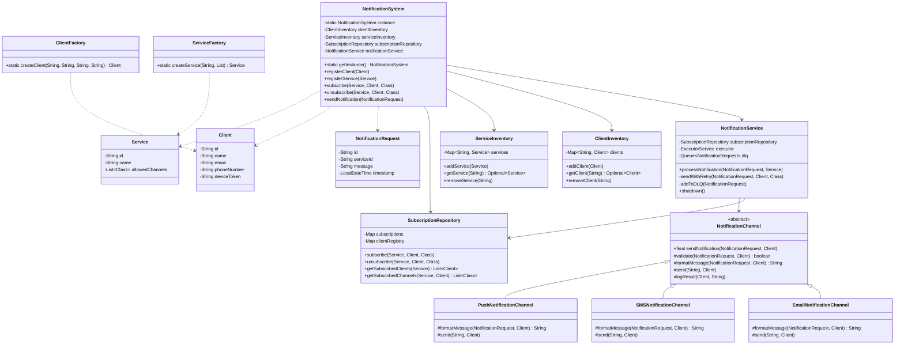

# Notification Service — Design Document

## Overview

A central notification broker that allows backend services to publish notifications, which are fanned out to subscribed clients across multiple channels (Email, SMS, Push).

---

## Design Patterns Used

**Singleton** — `NotificationSystem` is a single entry point managing all subscriptions and routing.

**Template Method** — `NotificationChannel` defines a fixed delivery sequence: `validate → formatMessage → send → logResult`. Subclasses override only what's channel-specific.

**Strategy** — Each concrete channel (`EmailNotificationChannel`, `SMSNotificationChannel`, `PushNotificationChannel`) encapsulates its own formatting and delivery logic behind a common interface.

**Builder** — `NotificationRequest` uses a builder to cleanly construct requests with optional fields.

**Factory** — `ClientFactory` and `ServiceFactory` handle object creation and UUID generation, keeping construction logic out of the caller.

---

## Architecture

```
Backend Service
      │
      ▼
NotificationSystem (Singleton)
  ├── ClientInventory         ← stores registered clients
  ├── ServiceInventory        ← stores registered services
  ├── SubscriptionRepository  ← Map<serviceId, Map<clientId, List<Channel>>>
  └── NotificationService
        ├── ExecutorService   ← parallel fan-out per (client, channel)
        ├── Retry + Exponential Backoff
        └── Dead Letter Queue (DLQ)
```

---

## Class Diagram



---

## Class Responsibilities

| Class | Responsibility |
|---|---|
| `NotificationSystem` | Singleton entry point; registration, subscription validation, routing |
| `NotificationService` | Fan-out, parallel delivery, retry, DLQ |
| `NotificationChannel` | Template method defining delivery sequence |
| `EmailNotificationChannel` | HTML formatting, email delivery |
| `SMSNotificationChannel` | Plain text + 160-char truncation, SMS delivery |
| `PushNotificationChannel` | 100-char truncation, push delivery |
| `SubscriptionRepository` | Stores `Map<serviceId, Map<clientId, List<Channel>>>` |
| `ClientInventory` | CRUD store for `Client` objects |
| `ServiceInventory` | CRUD store for `Service` objects |
| `NotificationRequest` | Immutable value object: serviceId, message, timestamp |
| `ClientFactory` | Creates `Client` with auto-generated UUID |
| `ServiceFactory` | Creates `Service` with allowed channels and auto-generated UUID |

---

## Subscription Model

Subscriptions are keyed by `(serviceId, clientId)`. A client can only subscribe to channels that the service explicitly allows via `allowedChannels`. This check is enforced in `NotificationSystem.subscribe()` before delegating to the repository.

```
subscribe(service1, alice, EmailChannel)  ✓  // service1 allows Email
subscribe(service1, alice, PushChannel)   ✗  // service1 does not allow Push → throws
```

---

## Notification Flow

1. A backend service calls `NotificationSystem.sendNotification(request)`
2. `NotificationSystem` validates the service exists in `ServiceInventory`
3. Delegates to `NotificationService.processNotification(request, service)`
4. Fetches all clients subscribed to the service from `SubscriptionRepository`
5. For each `(client, channel)` pair, submits a task to `ExecutorService`
6. Each task calls `NotificationChannel.sendNotification(request, client)` — the template method
7. On failure, retries up to 3 times with exponential backoff (1s → 2s → 4s)
8. If all retries exhausted, request is added to the DLQ

---

## Thread Safety

| Component | Mechanism |
|---|---|
| `NotificationSystem.getInstance()` | `synchronized` |
| `ClientInventory`, `ServiceInventory` | `ConcurrentHashMap` |
| `SubscriptionRepository.subscribe()` | `synchronized` method |
| `NotificationService.dlq` | `ConcurrentLinkedQueue` |
| Delivery fan-out | `ExecutorService` (CachedThreadPool) |

---

## Failure Handling

- **Retry**: up to 3 attempts per `(client, channel)` with exponential backoff
- **DLQ**: exhausted retries are moved to an in-memory `ConcurrentLinkedQueue` for audit/replay

---

## Extensibility

To add a new channel (e.g. Slack):
1. Create `SlackNotificationChannel extends NotificationChannel`
2. Override `formatMessage()` and `send()`
3. No changes needed to `NotificationSystem`, `NotificationService`, or any existing class
