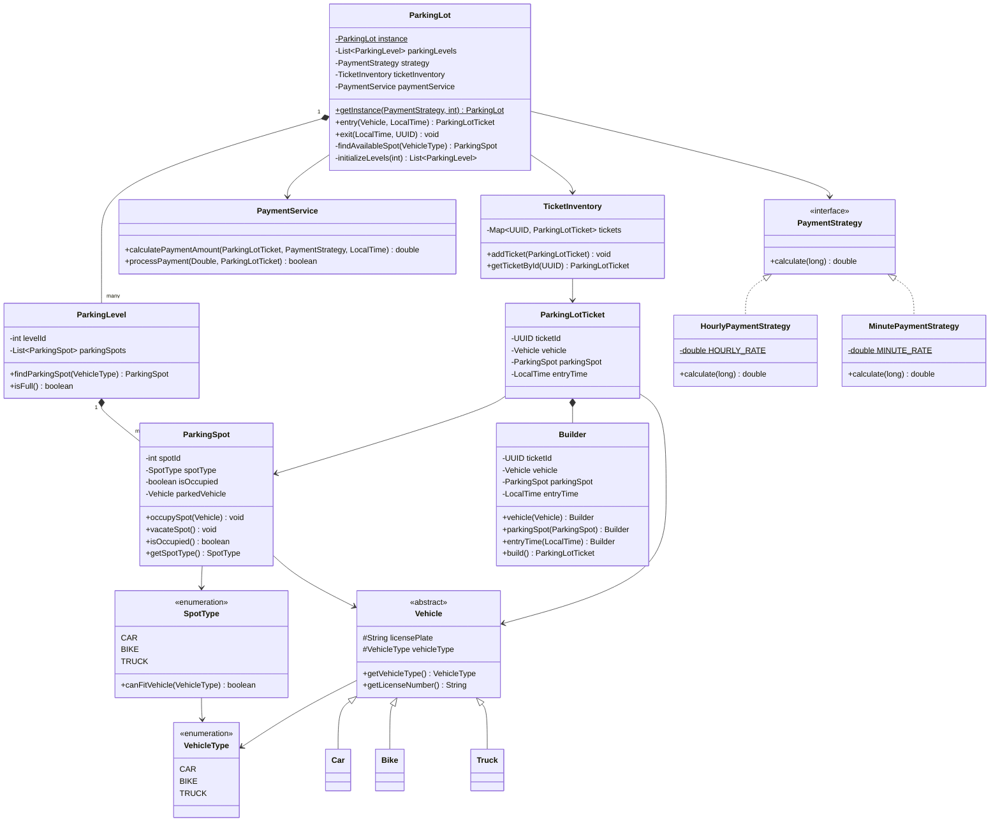

# Solution: Parking Lot

## Components Used

1. `ParkingLot` (facade): Facade over the entire system — manages levels, spot assignment, ticketing, and payment.
    - `getInstance(PaymentStrategy, int levels)`: Returns the singleton instance, initializing levels on first call.
    - `initializeLevels(int totalLevels)`: Creates parking levels with a default set of spots (2 bike, 3 car, 1 truck per level).
    - `entry(Vehicle vehicle, LocalTime entryTime)`: Finds a spot, occupies it, issues and stores a ticket.
    - `exit(LocalTime exitTime, UUID ticketId)`: Retrieves ticket, calculates fee, processes payment, vacates spot.
    - `findAvailableSpot(VehicleType vehicleType)`: Scans levels for an unoccupied compatible spot.

2. `ParkingLevel`: Represents a floor in the parking lot, holds a list of parking spots.
    - `findParkingSpot(VehicleType type)`: Returns the first unoccupied spot compatible with the vehicle type.
    - `isFull()`: Returns true if every spot on this level is occupied.

3. `ParkingSpot`: Represents an individual spot, tracks occupancy and spot type.
    - `occupySpot(Vehicle vehicle)`: Marks the spot occupied and records the vehicle.
    - `vacateSpot()`: Clears the vehicle and marks the spot free.

4. `Vehicle` (Abstract Class): Base class for all vehicle types.
    - `getVehicleType()`: Returns the vehicle type enum (CAR, BIKE, TRUCK).
    - `getLicenseNumber()`: Returns the license plate.

5. `Car`, `Bike`, `Truck`: Concrete vehicle types, each passing the appropriate `VehicleType` to the parent constructor.

6. `ParkingLotTicket`: Immutable ticket issued on entry, built via an inner Builder.
    - Fields: `ticketId` (auto-generated UUID), `vehicle`, `parkingSpot`, `entryTime`.
    - `ParkingLotTicket.Builder`: Fluent builder; generates `ticketId` in `build()` and validates required fields.

7. `TicketInventory` (repository): Thread-safe store for active tickets.
    - `addTicket(ParkingLotTicket)`: Stores a ticket keyed by its UUID.
    - `getTicketById(UUID)`: Retrieves a ticket by ID.

8. `PaymentService`: Handles fee calculation and payment processing.
    - `calculatePaymentAmount(ticket, strategy, exitTime)`: Computes duration in minutes and delegates to the strategy.
    - `processPayment(amount, ticket)`: Simulates payment processing.

9. `PaymentStrategy` (interface): Defines the pricing contract.
    - `HourlyPaymentStrategy`: Charges $2.00/hour, rounding up partial hours.
    - `MinutePaymentStrategy`: Charges $0.05/minute.

## Patterns Used

- **Singleton** — `ParkingLot` has a single shared instance via `synchronized getInstance()`, ensuring one lot manages the whole structure.
- **Facade** — `ParkingLot` (in the `facade` package) hides the complexity of levels, spots, ticketing, and payment behind simple `entry()` and `exit()` methods.
- **Strategy** — `PaymentStrategy` interface with `HourlyPaymentStrategy` and `MinutePaymentStrategy` allows pricing models to be swapped without changing core logic.
- **Builder** — `ParkingLotTicket.Builder` constructs immutable tickets with a fluent API, auto-generating the UUID in `build()`.
- **Repository** — `TicketInventory` abstracts ticket storage and lookup, keeping persistence concerns out of the facade.
- **Template Method / Inheritance** — `Vehicle` is abstract; `Car`, `Bike`, and `Truck` extend it, supplying only their specific `VehicleType`.
- **Concurrency** — `TicketInventory` uses `ConcurrentHashMap` with `synchronized` methods to safely handle concurrent entry/exit operations.

## Known Gaps

- **`LocalTime` instead of `LocalDateTime`** — stays crossing midnight produce incorrect durations. `Math.abs` masks the issue. Fix: use `LocalDateTime` or `Instant` for entry/exit times.
- **`MinutePaymentStrategy` bug** — divides duration by `1000 * 60` (milliseconds denominator) but receives minutes from `PaymentService`. Should use `duration` directly.
- **`ParkingLotTicket` constructor is `public`** — should be `private` to enforce creation exclusively through the Builder.
- **Ticket not removed from inventory on exit** — processed tickets remain in `TicketInventory` indefinitely. `exit()` should call `ticketInventory.removeTicket(ticketId)` after payment.
- **`exit()` not synchronized** — a spot is vacated outside any lock, which can race with a concurrent `entry()` finding that spot mid-vacate. Wrap `vacateSpot()` in a `synchronized (this)` block.
- **`PaymentProcessor.java` in root** — stale unused file leftover from earlier iteration, should be deleted.

## Class Diagram

## Representation

